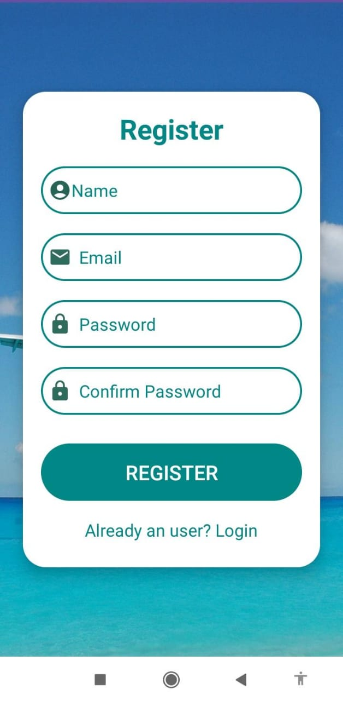
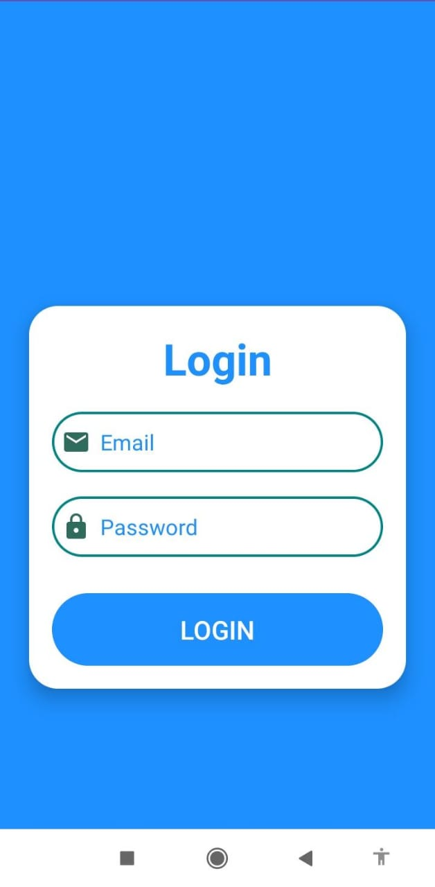
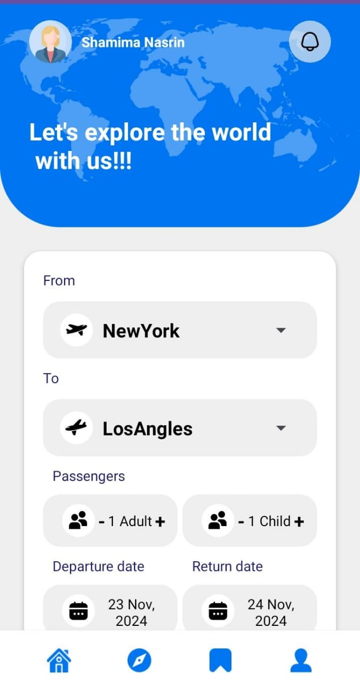
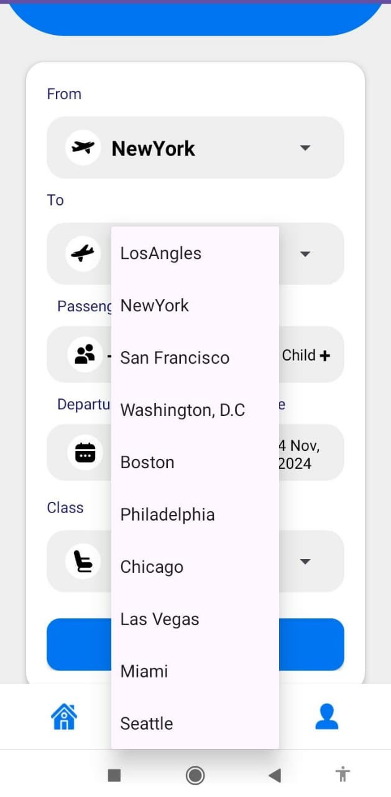
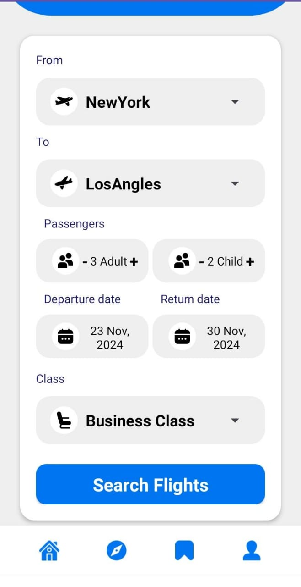
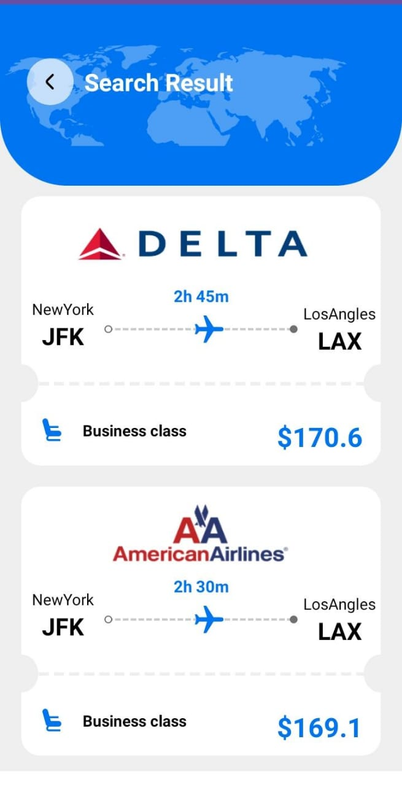
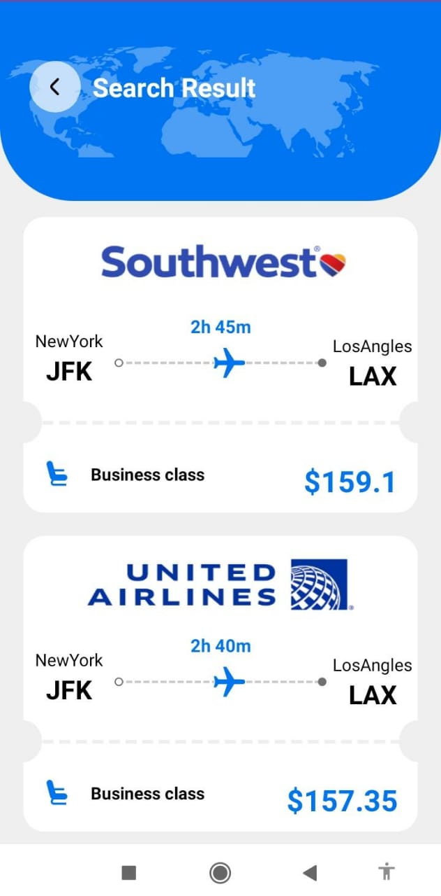
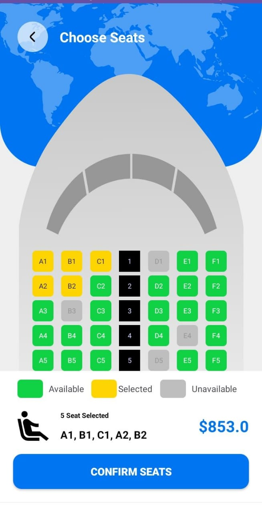
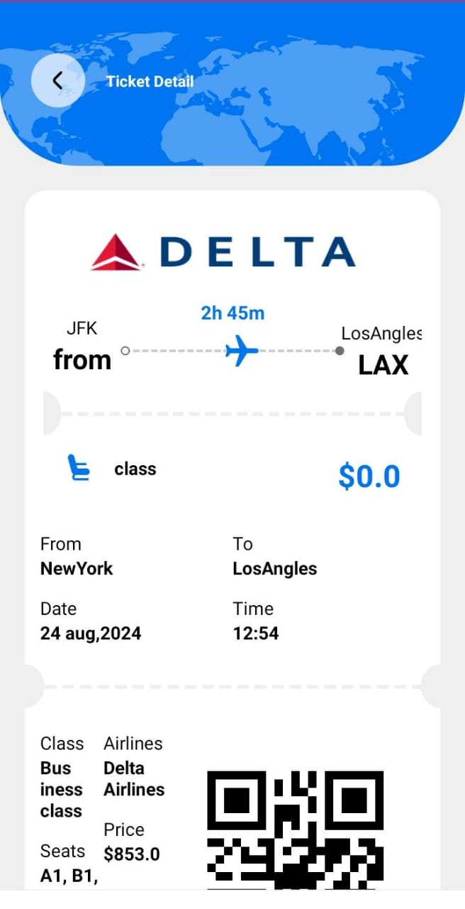
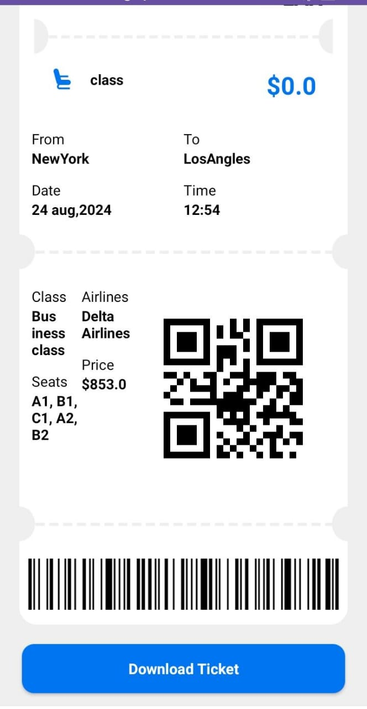

# Air Ticket Booking Application

A comprehensive mobile application for seamless flight ticket booking, developed using **Java**, **Firebase**, and **Android Studio**. The application enables users to search for flights, book tickets, and manage bookings efficiently.

## Features

- **User Registration and Authentication**:
  - Secure login and registration functionality.
  - Firebase Authentication integration.

- **Flight Search and Booking**:
  - Real-time flight search by date, destination, and airline.
  - Seat availability and dynamic fare calculation.

- **Ticket Management**:
  - View and download tickets.
  - QR code and barcode generation for ticket validation.

- **Backend Integration**:
  - Firebase for real-time database, cloud storage, and backend operations.

## Screenshots

### Registration Screen

### Login Search

### Start Page

### Required Details to Search Flights

### Search Result

### Choose Seat

### Ticket Details

### Ticket Download

## Technologies Used

- **Frontend**: Java, XML (Android UI components)
- **Backend**: Firebase (Authentication, Realtime Database, Cloud Storage)
- **IDE**: Android Studio
